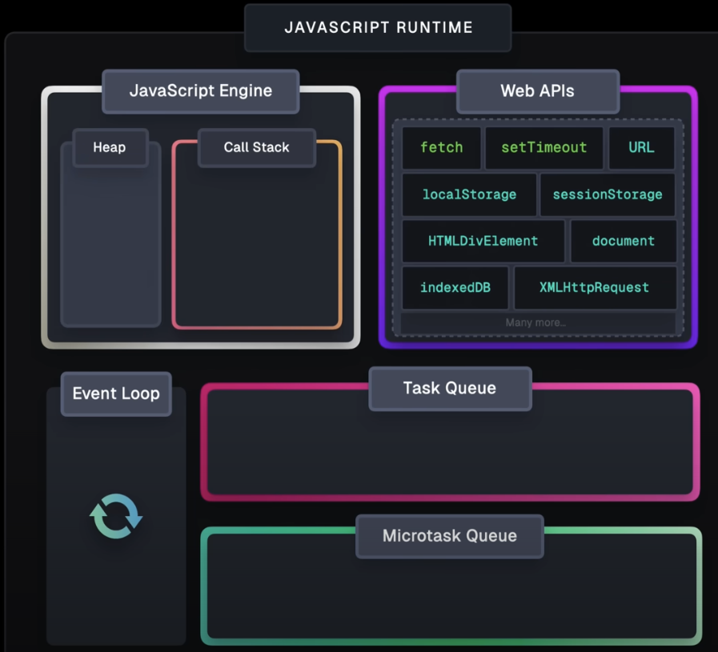
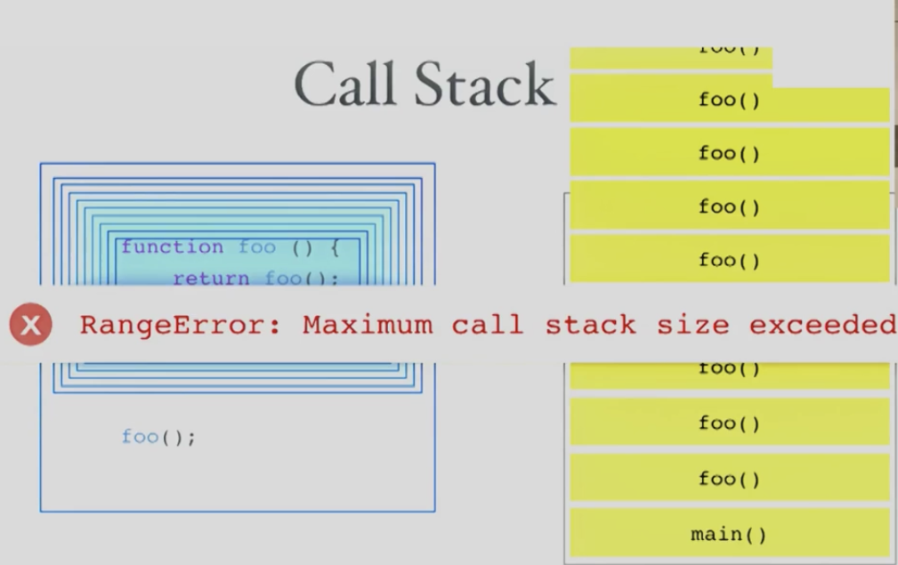
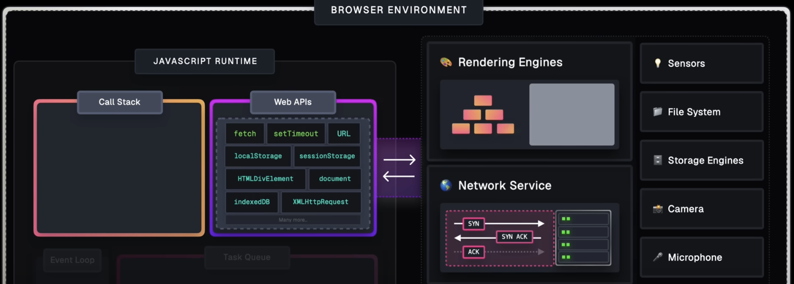

## 探討 JS 非同步運作原理 

## 前言

大家都知道運行 JS 的 runtime 有兩種：NodeJS、瀏覽器。
以下 JS 底層運作學習記錄的視角是以瀏覽器為主，但其實說到如何**解決 Single-threaded 單線程的限制的**背後核心運作流程概念都是雷同的就差在運行環境、實現方式不同。理解了瀏覽器後就能理解 NodeJS 是如何做到的。

先草草帶過以後有機會再研究：NodeJS 無論是 Web APIs、Event loop..等等機制的實現方式都是透過 [libuv](https://github.com/libuv/libuv) 這一個library。

以下筆記用到的截圖都來自於：[超頂的可視化介紹](https://www.youtube.com/watch?v=eiC58R16hb8)


## 大家都知道 JS 是 Single-threaded，那到底什麼是 Single-threaded？

簡單一句話：Single-threaded === signle callstack === 同一時間只能執行一段程式碼
所謂的 thread 就是系統處理工作的基本單元，在很多系統中很常會運用多線程去達到同時執行很多事物、提升整個應用程式的性能，然而，JS 卻是基於 Single-thread 的一個語言，那是不是代表 JS 就是一個超爛的程式語言？

當然不是！JS 有趣的點就是其如何設計出一套儘管是 Single-thread 也不會低效能甚至能跟多線程並駕齊驅的機制。

## JS 是如何解決 Single-threaded 單線程的限制的？

首先，應該先了解 Single-threaded 有什麼限制，就像開頭講的同一時間只能執行一段程式碼，所以當某個任務花的時間特別長就會導致整個應用程式被凍住，比如：network req / timer…。

而 JS 透過五大元件間的協調設計出的機制，實現了儘管 Single-threaded 照樣高效能，解決了一堆非同步(異步)的操作需求，可以參考以下截圖（來源有附在最下面）
- Call Stack
- Web APIs
- Task Queue
- Microtask queue



### Call stack 是啥？

call stack 就是一直在說 Single-Threaded 的那一個 Thread，專門用於管理運行(execution contexts)程式碼的一個元件。而 V8 engine 就是由 call stack 跟 heap 組成的，無論是 NodeJS 還是 Chromium-based browser 的核心都是如此。
可以看到以下範例透過函式呼叫自己，形成一個永無止盡的運行，這個時候 call stack 就會被塞爆～




### Web apis 是啥？

就是**瀏覽器環境**提供的一整組功能，由瀏覽器本身去實現的（跟 V8 engine無關），像是以下：
- timer: setTimeout、setInterval
- DOM 操作：document、getElementById
- 事件處理：addEventListener
- 網絡請求：fetch、XMLHttpRequest
.....更多

而 Web apis 主要扮演的角色就像是一個極大的空間，當 call stack 遇到非同步事件、任務時，就會丟給這個空間背景運行後，繼續執行其他同步事件、任務。

> [!NOTE]
> 那什麼是非同步事件、任務？
> 其實就是很花時間，不能夠等到完全執行好才能繼續的任務，比如：
> * timer
> * 網絡請求 fetch...

可以參考以下截圖來了解 Web apis 到底有啥功能，接下來就是當非同步事件、任務丟進 Web apis 執行完後的事情了。


### ...Queue 是啥？

非同步任務、事件在 Web apis 執行完後，並不會直接將結果丟回 call stack，而是會將執行的結果（此處的結果通常會是一個 callback function）丟入 Queue 裡，而 Queue 又基於事件任務的不同分成了以下兩種優先級 Queue（似乎可以以 callback-based / promise-based 做區隔）：
- TaskQueue
        - 專門處理比較複雜龐大型的任務
        - 優先級最低
        - ex: timer , I/O操作 , UI事件
- MicrotaskQueue
        - 專門處理小型可以趕快完成的任務
        - 優先級最高
        - ex: 比較特別的是：MutationObserver / queueMicrotask ，處此之外就是所有跟 promise 有關的函式xd
                - then, catch
                - Function body execution following await

> [!NOTE]
> **那為什麼非同步任務、事件在 Web apis 執行完後，不直接將結果丟回 call stack？**
> * 因為可能會干涉到正在 call stack 運行中的 task


Ok 那優先級是指什麼優先呢？
就是指**優先被 Event loop 處理的 queue。**

### Event loop 又是啥？

簡單來說：其實做的事很簡單 → 檢查 call stack 是否為空，空了就從 queue 拿
嚴格來說就是一個**管理非同步任務執行順序的機制**
- 何時該從 queue 拿，放到 call stack 執行
- 該從哪個 queue 拿，哪個 queue 優先處理

那基本上 Event loop 的執行流程就是這樣跑：
1. 檢查 Microtask queue，如果有程式碼在等待，**且 call stack 是空的**，優先移至 call stack 執行
2. 如果 Microtask queue 空的，則檢查 Task queue，如果有程式碼在等待，**且 call stack 是空的**，移至 call stack 執行。


> [!NOTE]
> 無論如何，都會先確認 call stack 是空的才會取 queue 進 call stack 執行！
> 也因此，timer delay 時間到了也不代表會立馬執行（depends on call stack size


## 其他有趣討論

既然我們之後非同步事件、任務處理完畢時，會移至 queue 做等待，那肯定是會有塞爆的問題吧，根據以下情境，用戶一滑滑鼠就會觸發一坨非同步事件，也就是會塞爆 Task queue，當點擊時可能也要等個幾分鐘才會輪到 onClick()被執行，
```js
// 滑鼠滑動會觸發 mousemove 事件
$.on('document', 'mousemove', function onMousemove() {
    console.log('Mousemove Real Callback Execute');
});

$.on('button', 'click', function onClick() {
    console.log('Click Callback Execute');
});
```
但其實這很好解，只要讓滑鼠移動的非同步事件不要那麼快進到 Task queue 就好，實現方式很簡單，timer就好啦！讓他先去到 Web APIs 裡慢慢跑，就能解決按鈕卡頓了。而常見用於解決**頻繁觸發事件行為導致卡頓** 的延伸概念：Debounce 和 Throttle


------------


那 await 是怎麼做到同步化非同步任務的？
似乎就是 await 後的程式碼都會被視作 promise obj 的 fulfill/reject reaction callback function，例如以下例子中，getCurrentPosition 在執行時不是會被移入 Microtask queue 然後 console.log(location) 直接被執行嗎？但並不是，實際上應該會是以下的運作流程：

一樣以 call stack 視角觀察：
1. execute getUserLocation()→ 實際上是建立一個promise，函式裡面的程式碼可以視作 fulfill/reject reaction callback function
2. execute getCurrentPosition() → 建立另一個promise obj，且await之後的程式碼都可以視作這個新 promise 的 fulfill/reject reaction callback function 
3. execute executor function from new Promise obj
4. move the network req to Web apis and execute in the background
5. when receiving the response from network req → Promise obj statue / result change and  fulfill/reject reaction callback function will be pushed to Microtask queue
6. if callstack is empty, event loop move the fulfill/reject reaction (console.log(location)) to callstack and execute

```js
function getCurrentPosition() {
	return new Promise((resolve, reject) => {
		navigator.geolocation.getCurrentPosition(resolve, reject)
	})
}

async function getUserLocation() {
	try {
		const location = await getCurrentPosition();
		console.log(location)
	}catch(err){
		console.error(error)
	}
}
```


## 總結心得

以前對於 js 單線程啊、非同步處理、Event loop、一堆 queue 這些東東都是摸個皮毛，連一些名詞都都是現在才搞清楚原來是指同個東西啊xd..
但其實這篇學習研究紀錄完後，也還是有許多地方需要在深入探討的，比如：NodeJS是如何實現的？libuv到底在幹嘛？、V8 engine 底層怎麼運作的？await 的行為真的是如此嗎？等等的問題。

總之，透過這次的深入學習，除了跟 JS 變得更要好了之外，也更習慣去問自己更多個「Why」，而不是停留在「How」而已，大大提升了自己的學習能力，非常感謝小賴老師這堂課促成給自己機會去深入學習平常不會或藉口沒時間去學習的地方！


## ref

- [小賴老師的補充教材](https://exploringjs.com/js/book/ch_promises.html#the-basics-of-using-promises)
- [超頂的可視化介紹](https://www.youtube.com/watch?v=eiC58R16hb8)
- [某某部落格](https://www.programfarmer.com/articles/2021/javascript-browser-event-loop)
        - 但我極度懷疑這篇最後面總結的第四點 Event Loop 運作流程有講錯