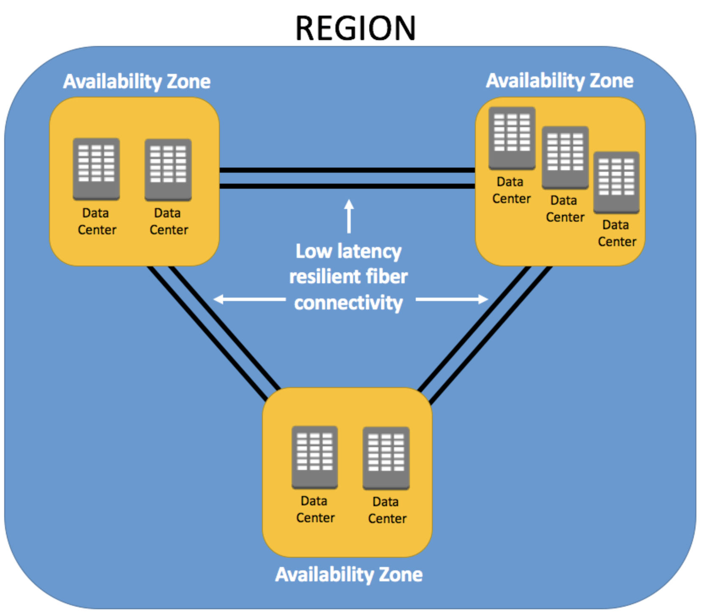

## 什麼是 AWS Region, AZ (availability zones)

要怎麼做到連上相隔十萬八千里遠的 host卻不會等待老半天？ AWS 就是主要透過Region、AZ 來實現的。

由 Bottom-up 的方式來看的話，多個 Data Center 會組成一個 AZ（可用區域），而多個 AZ 會組成一個 Region，而Region 就是一個地理區域，比如：美國東部、歐洲、亞太 （[現有的Region](https://aws.amazon.com/about-aws/global-infrastructure/regions_az/?nc1=h_ls)）

這樣的設計就像是多層式的防止單點失效，極大程度確保服務不間斷，儘管某個Data Center掛了其他Data Center也能馬上遞補，某個AZ掛了其他AZ遞補（Multiple AZs）
> If you distribute your instances across multiple **Availability Zones** and one instance fails, you can design your application so that an instance in another Availability Zone can handle requests
> By launching your instances in separate Availability Zones, you can protect your applications from the failure of a single location in the Region.

當某個 AZ 的實例掛掉時，也可以快速的把 Elastic IP 重新映射到另一個 AZ 的instance，彷彿沒掛一樣
> You can also use Elastic IP addresses to mask the failure of an instance in one Availability Zone by rapidly remapping the address to an instance in another Availability Zone.

- Data center 就是一個集中存放計算資源和相關基礎設施 (ex: 伺服器, 電力供應、冷卻系統、網絡設備) 的地方，當一個地方出現問題，也不會影響到在那AZ之下的instance。
- 通常在設定instance 所在的Region時會根據這個instance的服務對象決定，比如：當目標客戶在歐洲，那就會設置在歐洲，減少網路傳輸的費用與時間。
- 每個Region下會透過VPC（虛擬網路）將所有 AZ 包住，一方面做到Region間的網路隔離，一方面讓AZ間可以資源共享的更加安全與方便。

> [!NOTE]
> 那為什麼有了VPC可以更加安全呢？（VPC/VPN 尚須深入研究）
> 目前了解：未進入此虛擬網路的裝置是無法存取VPC內的任何資源 ex: ssh近主機之類的

## 如何抉擇適合的Region?

我認爲最主要的點就是「系統需求」，如果需求是目標客戶的請求響應速度，那就是挑物理距離與目標客戶最近的Region，盡可能簡短資源傳輸距離來做到減少網絡延遲（latency）

同樣的服務，比如：EC2,S3...，在不同Region的收費的收費定價不同（地區的土地、電力、冷卻等基礎設施都會反映在價格上），所以需要省錢的可以再決定前好好研究不同區域服務的定價差別

## Ref
- [AWS - Region and Zones](https://docs.aws.amazon.com/AWSEC2/latest/UserGuide/using-regions-availability-zones.html#concepts-regions)
- [30天鐵人賽介紹 AWS 雲端世界](https://ithelp.ithome.com.tw/m/articles/10192075)