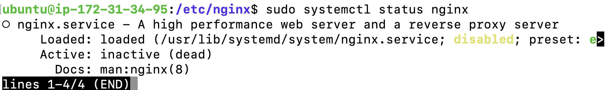

# troubleshooting lab

## 總共有哪些問題、發現什麼事情
1. Nginx 不會自動重啟
2. main Nginx.conf 語法問題
3. 用於處理 curl localhost 請求的 web server 提供的文件有權限問題
4. port 80 被某個由 golang 撰寫的程式占用，而且 reboot 後會重新佔用
5. 防火牆阻擋了 http 請求，而且 reboot 後此阻擋會復活

## 檢查邏輯順序
1. 檢查 Nginx 是否活著

2. 無腦啟動看看錯誤訊息

3. 抓出 Nignx 設定檔的語法問題
```bash
**ubuntu@ip-172-31-32-104**:**/etc/nginx**$ nginx -t

2024/11/07 06:29:31 [warn] 1279#1279: the "user" directive makes sense only if the master process runs with super-user privileges, ignored in /etc/nginx/nginx.conf:1

2024/11/07 06:29:31 [emerg] 1279#1279: unexpected ";" in /etc/nginx/nginx.conf:8

nginx: configuration file /etc/nginx/nginx.conf test failed
```
4. 進入到 `/etc/nginx/nginx.conf` 排除問題後重啟 Nginx
5. Nginx 重啟成功後，發現 curl 還是不行，透過 `/etc/nginx/nginx.conf` 指出的 include 語法找到到底哪裡的 nginx 設定檔會處理 curl localhost 的請求回傳，同時檢查 `/var/log/nginx/error.log` 找出錯誤訊息


6. 直接 kill 掉佔用的 srv 程式後，再重啟 Nginx，發現還是不行，於是進到 `/etc/nginx/sites-available` 檢查如何處理請求的，語法沒問題，接著檢查`/var/log/myweb/error.log` 發現權限問題，把/var/myweb之下的靜態文件所屬改為 www-data

7. 改好權限後，發現還是不行，懷疑起防火牆的問題，想安裝 ufw 來看防火牆設定，發現空間不足，改用 iptables 後檢查，發現是 http 被擋住，將它刪除後，就正常了！


## 其他
1. 發現 reboot 後
- 先前 kill 掉的 srv 程式會重新佔用 port 80 -> 透過 `systemctl disable` 移除系統啟動流程，終止此程式自動重啟
- nginx 不會自動重啟 -> 一樣透過 `systemctl enable` 把 nginx 加入系統啟動流程
- 先前刪除掉的防火牆設定又復活了，因為 `sudo iptables -D INPUT 1` 只是暫時性（當前運行），實際上防火牆是根據 `/etc/iptables/rules.v4` 下的設定檔在每次重啟時建起來的-> iptables-persistent，所以需要進到此檔案下將此規則刪除。
```bash
ubuntu@ip-172-31-44-33:/etc/iptables$ cat rules.v4
# Generated by iptables-save v1.8.10 (nf_tables) on Fri Oct 11 08:10:47 2024
*filter
:INPUT ACCEPT [153:11068]
:FORWARD ACCEPT [0:0]
:OUTPUT ACCEPT [0:0]
-A INPUT -p tcp -m tcp --dport 80 -j REJECT --reject-with icmp-port-unreachable
COMMIT
# Completed on Fri Oct 11 08:10:47 2024
```

2. 老師偷塞的大檔案
```bash
ubuntu@ip-172-31-44-33:/etc/nginx$ sudo find / -type f -size +500M
/var/log/system/largefile1
/var/log/system/largefile2
/var/log/system/largefile4
/var/log/system/largefile3
/proc/kcore
find: ‘/proc/1307/task/1307/fdinfo/6’: No such file or directory
find: ‘/proc/1307/fdinfo/5’: No such file or directory
```


## 心得

刺激好玩又能學到很多還能增加團隊合作能力！！感謝小賴老師精心準備的這個 troubleshooting lab，利用自己目前所有的認知去想辦法解決實務上系統可能會遇到的問題，加上一群人一起去 debug，這樣的環境讓自己更清楚還有哪些不足，也能學到別人是怎麼解決問題的，思考角度切入點哪裡不同等等！

如果可以再多幾個這種 Lab 就好了xd..


